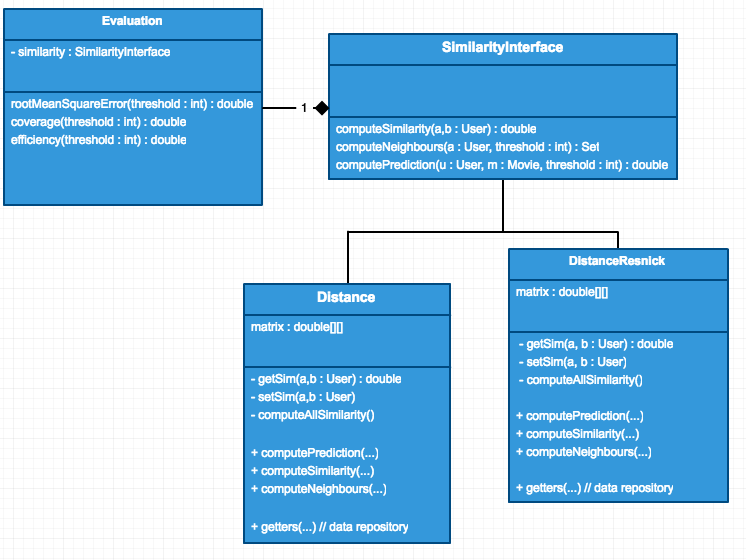

```{r setup, include=FALSE}
knitr::opts_chunk$set(echo = FALSE)
knitr::opts_chunk$set(warning = FALSE)
knitr::opts_chunk$set(message = FALSE)

load('data.RData')
require('reshape2')
require('ggplot2')
```

\newpage

# Introduction

When our daily commerce went online since the turn of the millenia almost 20 years ago, the cost of maintaining information about the goods has drastically reduced, while the interface for shopping, as far as our attention when browsing products go, has not been improved to the same scale as the warehouse storing them [@benn2015navigating]. Take _amazon.com_ for example: the availability of the products on the platform is unpropotional to what an average user is able to focus the attention to. Even with the revolutionary search ability introduced through technology, vast majority of the products remain unexplored. Not to mention the economic benefit from tackling the _Long Tail_ problem [@anderson2006long], stores can potentially "sell less for more". This is where recommender systems come in. As a new channel of communication between stores and users, users will also receive recommendation on items that they might be interested in.

Collaborated Filtering (hereafter as **CF**)is one of the 2 major families of recommender system strategy. Unlike content-based strategy, which is focusing on analysing the item's features, CF is focusing on the users' behaviour. One of the reason behind this is **CF** boosts _diversity_. Simply put, similar items recommended using content-based strategy appeal less in terms of selling point, unless the user are aiming to collect a specific genre, which is not a common shopping beheviour. People are drawn to each other based on liked minds. **CF** can emulate a good friend, should one user's taste is being identified as similar to another within the system. 

This report describes the work involved in building a **CF** based recommender system, using varies methods, including distance metrics based similarity [@shardanand1995social], prediction formula by [@resnick1994grouplens] etc. Finally with the evalution of the involved methods. The Dataset being targeted in this report is a subset of the _MovieLens_ movie rating data. We will first explore the dataset, then introduce the **CF** techniques with an emphasise on the implementation side. In the later chapters evaluation and metics plots will be shown, with future work being hinted on how to explain the phanomena we observed while evaluating the result.

\newpage
# Exploratory of the Dataset

The Dataset is a subset of 100,000 movie ratings from _MovieLens_ database. A _rating_ 
is rated by one user on one movie with a rating score from $1$ to $5$. We expect that not every user has rated
every possible movies in the dataset. This implies that there are potentially 
way smaller number of unique users than the number of ratings. We confirmed this by looking
at the dataset by running aggregation statistics, including number of each rating score. 

```
User count: 943
Movie count: 1682
Rating count: 100000
Rating Density: 0.06304669364224531
Rating bin count for 1.0: 6110 2.0: 11370 3.0: 27145 4.0: 34174 5.0: 21201
Mean Rating: 3.52986
```


Briefly,
there are $943$ users and $1682$ movies in the dataset. Further we can quantise the overall degree
how much is the 100,000 ratings being covered in all possible user $\times$ movie combination,
namely a density score given by $$density = \frac{|ratings|}{|possible\_pair|}$$. 

As it turns out, the 
density is merely $6.3\%$. The average rating overall is $3.5$. From figure \@ref(fig:stats) we can 
see the involved users have mostly rated high. 

```{r stats, fig.cap="Bin Count"}
ggplot(movielens, aes(x = rating_score)) + geom_bar() + xlab("Rating Score") + ylab("Count")
```


As each user might have rated a list of movies, it is also interesting to look
at how the rating score looks like from a per user stand point. I calculated
basic statistics for each user's rating scores. There are for example only $1$ 
user who have a max rating score of $3$, while $26$ of them have a max score of $3$.

```{r perUser_max3, fig.cap="Max Score Frequency", echo=T}
table(stats_user$max)
```
```{r perUser_min3, fig.cap="Min Score Frequency", echo=T}
table(stats_user$min)
```

The average variance of rating scores between user is

```{r perUser_var, echo=T}
mean(stats_user$sd) ^ 2
```
which indicates that even though this batch of users rated mostly higher than $3$,
the diversity is still significant.

Similar to statistics for each user, I also performed analysis on ratings for 
each movie. 

```{r perMovie_describe}
summary(stats_movie[,c(2,3,4,5,6)])
```


\newpage
# Design of the **CF** implementation

The design is followed along a bottom-up approach, such that core functionalities
were first addressed in a composable fashion. The main concerns included how to
calculate similarity quickly, how to calculate neighbours based on similarity quickly
and how to design data structures that trade memory with speed. 

## Design with core functions in mind
As in typical bottom-up strategy, before thinking about optimal data structure for 
the job, the core functionalities were being specified out first. 

In this stage, 
I looked at similarity calculation between the user pair (User $a$, User $b$) first. For both distance and cosine similarity,
we have to loop through (in order of $O(n)$) the common set of movies that both users have rated. This prompted that the
**User** class should have method that deliver the common set easily. 

Next for the neighbours calculation, I took the assumption that all similarities are calculated and
stored to allow $O(1)$ retrieval, given user pair ($a$,$b$). The problem of getting neighbours from ranked similarity score is 
a typical search problem: this hinted at sorting the similarities before doing anything is
most efficient approach. Both heap and Red-black tree based datastructure for temporary neighbourhood list for
the targeted user can provide this speed up. 

Finally for prediction calculation, given the neighour list, prediction is a simple order $O(n)$ operation. 


\newpage
Pseudo code for compute similarity:

```
func computeSim(a, b : User) similarity : double
	commonMovies := a.getCommonMovies(b)
	...
	for (m : commonMovies) {
		calculateMetrics(a.getRating(m), b.getRating(m))
	}
	...
	return finalMetrics
```

Pseudo code for compute neighbourhood:

```
func computeNeighbour(u : User) neighbours : Collection
	init(heap)
	init(neighbours)
	for (v : allUsers) {
		heap.insert( getSimilarity(u,v) )
	}
	while (neighbour.size < desired && heap.notEmpty) {
		neighbour.add( heap.top() )
	}
	return neighbour
```

Pseudo code for compute prediction:

```
func predict(a : User, m : Movie) rating : double
	neighbours := computeNeighbour(a)
	for (n : neighbours) {
		similarity := getSimilarity(a,n)
		calculatePrediction(similarity, a.getRating(m))
	}
	...
	return finalPrediction
```

High-level pseudo code shown above for the corresponding design suggested that for next stage of design, the focus should be designing correct facilities to make sure the complexity does not go higher.

## Data repository facilities

Following along the rationale from previous section, several data repository are
required for the operations. Among which, the similarity repository for allowing
$O(1)$ retrieval given a user pair should either be a **User** $\times$ **User**
matrix, or compounded key based dictionary. While dictionary potentially uses less
space than 2-D matrix for users, due to the diagonal value being useless, there
is no benefit from using a dictionary. Depending on the language for the implementation,
for this case I'm using **Java**, 2-D matrix for users similarity score is easier to
code.

A set of all users were also required in the previous analysis, which is provided
by the **IO** facility when doing the dataset **IO** operations.

Because the **IO** facility were providing ratings set and movies set as well, it
makes sense to have similarity class take them as argument too, for better encapsulation and
prepare for interfacing with **Evaluation** module.

## Evauluation module and Composablity

In the scope of this implementation, the evaluation strategy is leave-out-out. In
other words, the evaluation module will essentially loop through all the ratings,
such that for each rating we calculate predicted rating for that **User** $\times$
 **Movie** pair and calculate error between the predicted and the actual rating.

Due to the encapsulation of data repositories inside similarity module, the evaluation
module is very easy to implement: all it needs is a dependency of similarity. Further,
because we know that there are different methods to be benchmarked for the similarity
module, it makes sense to extract the previous contract to an interface.

Figure \@ref(fig:simEvalComposite) shows the composite between the modules.


```{r simEvalComposite, fig.cap="Composite of Evaluation and Similarity", fig.width=5}

```


## Model class and utilities

It is not common to address the Model class this late, after so many design has been
mapped out. The reason behind this is bottom-up imposes a minimal pressure on both
the complexity of model class and its dependencies. This however does not mean the Model
classes are trivial, as an example the **User** class has 2 special requirement other than
normal attributes for data encapsulation:

- for the **User** $\times$ **User** similarity matrix in the similarity module contract, indexing using **user_id** makes poor sense. The reason is that **user_id** is depending on the cleaness of the dataset, meanwhile what we need is the consistency for each and every programme execution. Therefore we must introduce an internal **id**. This is achieved using **static** keyword for the class attribute.
- as mentioned before, **User** class need to also have a method for common movies retrieval

Utilties other than **IO** modules are implemented in this stage. Among which the
logging facilities were designed to be a generic writer such that object serialisation
can be carried out without too much manual formatting. 

## Details for similarity implementations

4 similarity classes were implemented. The first one is **BaseLine**, which contains
only prediction calculation. It exhaustively loop through all users bar from the user
being predicted and deliver avarage rating as prediction. 

**Distance** implements [@shardanand1995social]'s distance based similarity and uses prediction
formula detailed in Collective Intelligence lecture. When calculating all similarity for the
**User** $\times$ **User** matrix, a fan-out to fan-in (or divide and merge) concurrency pattern
was implemented to facilitate speed-up from parallelism. Concretely, the amount of users to be
calculated is divided as evenly as possible to available compute cores on the system, and the subset workload is submitted to **ThreadPool** wrapped by **Executor**. Unlike parallelism for matrix multiplication, the $N\times N$ traversal requires slice by row or by column as one side and the other side must remain entire $N$. Otherwise the pairwise coverage will leave "holes" in the resulting matrix. 

$$
\sum_i^n w_i \otimes N
$$
where $w_i$ is the divided workload and $N$ is the entire set of users.

Resnick's prediction formula is implemented in the **DistanceResnick** and **PearsonResnick**. The latter 3 implementations delivers a prediction rating range of $(-1, 1]$, while if user $a$ and $b$ have no similarity the prediction will be $-1$. 

For all the non **BaseLine** implementeation, all similarity scores are computed
inside constructor so that when instance object were ready, they are immediately available
for prediction and evaluation runs.

\newpage
# Evaluation

Result metrics on prediciton for **BaseLine**, **Distance** and **DistanceResnick** were evaluated 
through a pipeline such that methods are parameterised using threshold and runs are repeated
to obtain enough datapoints for analysing.

## Evaluation pipeline
The pipeline consists **IO** house-keeping to populate data repositories, after that
_similarity_ classes are initiated (as mentioned in previous chapter, similarities 
are calculated at this point). For the **BaseLine** the threshold parameter have no meaning, therefore it's being run first. Followed by loop of runs with increasing threshold value
from 10 to 100 in step of 10 and from 100 to 300 in steps of 25.

Due to the nature of measuring runtime (efficiency) requires a full run of **RMSE**, there is 
no need to run **RMSE** separately in evaluation loop body, the evaluation result, which is augmented by utility classes, is responsible for giving out both run result and timing information.

## Evaluation of the result
### Efficiency (Time)

As hinted in previous chapter about the **BaseLine** prediction strategy, **BaseLine**
uses by far the longest time to complete due to it exhaustively include all users as neighbours
when predicting. The average run time for **BaseLine** on i7 mobile CPU with 8GB ram is $1460788$ milliseconds (1460 seconds) or roughly 25 minutes.


```{r time100, fig.cap="Efficiency Plot for threshold up to 100", fig.height=4}
ggplot(efficiencySub100, aes(x = threshold, y = efficiency, color=method)) + geom_line() + ylab("Time in milliseconds")
```


Average run time for all other methods shows up heavy correlation as the threshold parameter goes up, matching our expectation. Figure \@ref(fig:time100) shows the run time plot for threshold between 10 and 100. The high bump on low threshold for resnick is likely due to caching behaviour of the CPU, when running from an older generation chip the bump is gone.


Similarly the time required for completion beyond threshold value of 100 put much
pressure on **Resnick**, compared to **MSD** implementation. 

```{r time300, fig.cap="Time Plot for threshold between 100 and 300", fig.height=4}
ggplot(efficiency300, aes(x = threshold, y = efficiency, color=method)) + geom_smooth() + ylab("Time in milliseconds")
```

### Accuracy (**RMSE**)

For accuracy the **BaseLine** demonstrated a decent value of $1.1268639970237353$, this does
not necessarily indicate that **BaseLine** is good prediction algorithm, in fact, all it
shows is that the mean (expectation) of the spread is a "safe" value.

When comparing **MSD** with **MSD+Resnick** a trend of increasing accuracy (decrease of error value)
can be clearly observed in the following figure \@ref(fig:rmse100) and \@ref(fig:rmse300). However here the Resnick result shows diminishing growth when threshold value push on towards 100 and beyond. The same phanomena is not observed for **MSD**, which performed steadily along the 
increasing threshold.

```{r rmse100, fig.cap="RMSE Plot for threshold up to 100", fig.height=4}
ggplot(rmseSub100, aes(x = threshold, y = rmse, color=method)) + geom_line()
```
```{r rmse300, fig.cap="RMSE Plot for threshold between 100 and 300", fig.height=4}
ggplot(rmse300, aes(x = threshold, y = rmse, color=method)) + geom_smooth()
```


### Coverage

_Coverage_ denotes the degree how much ratings can be predicated by the algorithm. The **MSD** delivers similarity between users based on common movies, and the lack of commonality prevents
all further operation, including prediction. 

Unlike **BaseLine**, **MSD** and **MSD+Resnick** are affected by the threshold value. The more neighbours are considered for a prediction, the more likely a prediction can be made. Needless to say, **BaseLine** "dominates" this metrics by having a constant $1.0$ coverage. Figure \@ref(fig:cover100) and \@ref(fig:cover300) shows the coverage result for both non **BaseLine** methods. Notably, because **MSD+Resnick** uses the same similarity as **MSD** the coverage for both 2 are exactely the same, unlike **Pearson**, which regretably due to limited scope is not being evaluated.

```{r cover100, fig.cap="Coverage Plot for threshold up to 100", fig.height=4}
ggplot(coverageSub100, aes(x = threshold, y = coverage, color=method)) + geom_line()
```
```{r cover300, fig.cap="Coverage Plot for threshold between 100 and 300", fig.height=4}
ggplot(coverage300, aes(x = threshold, y = coverage, color=method)) + geom_smooth()
```


### Review

Taking another look at **MSD** and **MSD+Resnick** metrics, I gathered a further metrics by calculating variance of the errors for every rating during prediction. It is expected that the
variance will have high correlation in tendency as **RMSE**. Figure \@ref(fig:msd100) and \@ref(fig:msd300) confirms such assumption. 


```{r msd100, fig.cap="Metrics for MSD Plot for threshold up to 100", fig.height=4}
ggplot(msdSub100Only.melted) + geom_line(aes(x = threshold, y = value, color = variable))
```


```{r msd300, fig.cap="Metrics for MSD Plot for threshold from 100 to 300", fig.height=4}
ggplot(msd300Only.melted) + geom_smooth(aes(x = threshold, y = value, color = variable))
```


With the previous "strange" diminishing growth of the **RMSE** for **MSD+Resnick** in mind,
I was hoping to find the variance would explain the phanomena. However, I failed to find
such explanation. According to Figure \@ref(fig:resnick100) and \@ref(fig:resnick300) the variance
do not exhibit obvious cause for the poor performance.


```{r resnick100, fig.cap="Metrics for MSD + Resnick Plot for threshold up to 100", fig.height=4}
ggplot(msdrSub100Only.melted) + geom_line(aes(x = threshold, y = value, color = variable))
```


```{r resnick300, fig.cap="Metrics for MSD + Resnick Plot for threshold from 100 to 300"}
ggplot(msdr300Only.melted) + geom_smooth(aes(x = threshold, y = value, color = variable))
```


\newpage

# Recap and Future work

In this recommender system report, **MSD** similarity method and **Resnick** prediction method are explored by implementation. The importance of choosing suitable data-structure and meaningful architecture design shows great impact on run time efficiency metrics. With the increasing threshold value, **MSD** based methods outperformed **BaseLine** in terms of accuracy and efficiency. Future work remains to be done on further evaluating the **Pearson** similarity's performance, and more anlaysis is needed to explain why **Resnick** on **MSD** performs poorly.

\newpage
# References
